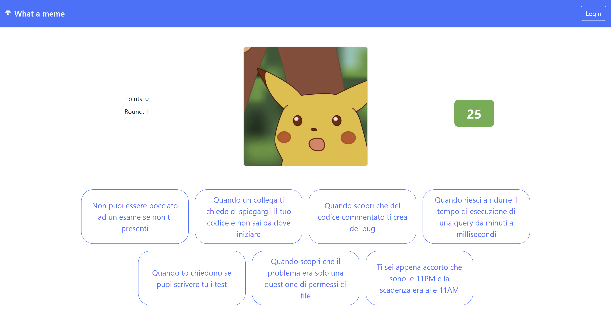
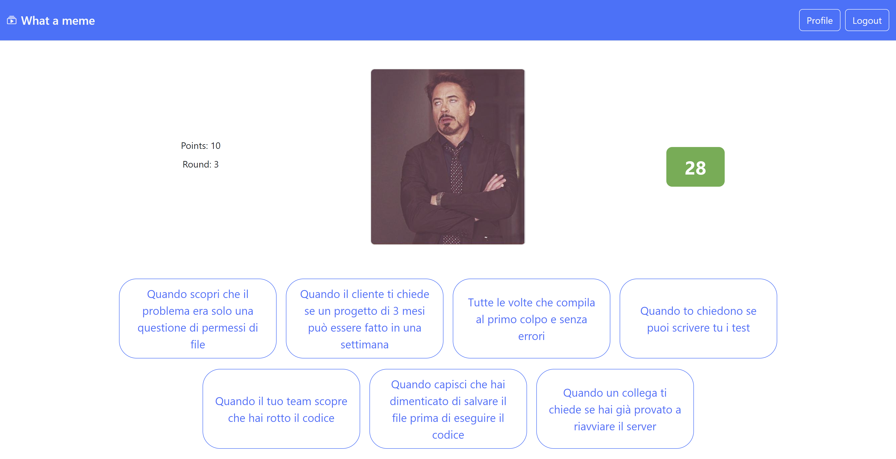

# Exam #1: "Meme Game"
## Student: s322788 Forte Filippo 

## React Client Application Routes

- Route `/`: Homepage with rules and possibility to start a new game
- Route `/game`: Page where the user can interact to guess the answer
- Route `/game-details`: Page where the user can see the details of his last game
- Route `/profile`: Contains the user info and his playing history
- Route `/login`: Login page

## API Server

### POST `/api/sessions`
- **Request Parameters and Body Content:**
  - Request Body: `{ "username": "user@example.com", "password": "yourpassword" }`
- **Response Body Content:**
  - Success Response: `200 OK`
  - On success: `{ "id": 1, "username": "user@example.com" }`
  - Error responses:  `401 Unauthorized`

### DELETE `/api/sessions/current`
- **Request Parameters:**
  - None
- **Response Body Content:**
  - Success Response: `200 OK`

### GET `/api/sessions/current`
- **Request Parameters:**
  - None
- **Response Body Content:**
  - Success Response: `200 OK`
  - On success: `{ "id": 1, "username": "user@example.com" }`
  - Error responses:  `401 User Not Authenticated`

### GET `/api/sessions/current/games`
- **Request Parameters:**
  - None
- **Response Body Content:**
  - Success Response: `200 OK`
  - On success: `[ { "id": 1, "score": 15, "rounds": [ { "memeId": 1, "guessed": true }, { "memeId": 2, "guessed": false } ] }, ... ]`
  - Error responses:  `401 User Not Authenticated`

### POST `/api/memes`
- **Request Parameters and Body Content:**
  - Request Body: `{ "count": 3 }`
- **Response Body Content:**
  - Success Response: `200 OK`
  - On success: `[ { "id": 1, "image": "meme1.jpg", "captions": [ "caption1", "caption2", "caption3" ... ] }, ... ]`
  - Error responses:  `500 Internal Server Error`

### POST `/api/meme/checkAnswer`
- **Request Parameters and Body Content:**
  - Request Body: `{ "memeId": 1, "captionId": 1 }`
- **Response Body Content:**
  - Success Response: `200 OK`
  - On success: `{ "correct": true }`
  - Error responses:  `500 Internal Server Error`

### POST `/api/meme/getAnswers`
- **Request Parameters and Body Content:**
  - Request Body: `{ "memeId": 1 }`
- **Response Body Content:**
  - Success Response: `200 OK`
  - On success: `[ { "id": 1, "text": "Correct Caption" }, ... ]`
  - Error responses:  `500 Internal Server Error`

### POST `/api/saveRounds`
- **Request Parameters and Body Content:**
  - Request Body: `{ "roundsData": [ { "memeId": 1, "guessed": true }, ... ], "userId": 1 }`
- **Response Body Content:**
  - Success Response: `204 OK`
  - Error responses:  `500 Internal Server Error`

## Database Tables

### Table `users`
Used to store the users
- **Columns:**
  - `id`: Integer, Primary Key, Autoincrement
  - `username`: String, Not Null
  - `password`: String, Not Null
  - `salt`: String, Not Null

### Table `memes`
Used to store the memes
- **Columns:**
  - `id`: Integer, Primary Key, Autoincrement
  - `image`: String, Not Null

### Table `captions`
Used to store the captions
- **Columns:**
  - `id`: Integer, Primary Key, Autoincrement
  - `text`: String, Not Null

### Table `meme_captions`
Used to store the relation between the meme and the correct captions
- **Columns:**
  - `meme_id`: Integer, Not Null, Foreign Key (references `memes.id`)
  - `caption_id`: Integer, Not Null, Foreign Key (references `captions.id`)
  - **Primary Key**: (`meme_id`, `caption_id`)

### Table `round`
Used to store the rounds
- **Columns:**
  - `id`: Integer, Primary Key, Autoincrement
  - `meme_id`: Integer, Not Null, Foreign Key (references `memes.id`)
  - `guessed`: Boolean, Not Null

### Table `game`
Used to store the games
- **Columns:**
  - `id`: Integer, Primary Key, Autoincrement
  - `user_id`: Integer, Not Null, Foreign Key (references `users.id`)
  - `score`: Integer, Not Null

### Table `game_round`
Used to store the relation between the game and the rounds
- **Columns:**
  - `game_id`: Integer, Not Null, Foreign Key (references `game.id`)
  - `round_id`: Integer, Not Null, Foreign Key (references `round.id`)
  - **Primary Key**: (`game_id`, `round_id`)

## Main React Components
- `GameLayout` (in `GameLayout.jsx`): General page to allow the user to play
- `GameManagement` (in `GameLayout.jsx`): Shows points, rounds and allows the user to see the game details
- `MemeCard` (in `GameLayout.jsx`): Shows the meme
- `AnswerButtons` (in `GameLayout.jsx`): Shows the possibile answers
- `GameStatus` (in `GameLayout.jsx`): Shows the timer and if he won or lost

- `GameDetails` (in `GameDetails.jsx`): Shows the details of the last game
- `GameRecap` (in `GameLayout.jsx`): Shows the results of the last rounds

- `HomeLayout` (in `HomeLayout.jsx`): Contains game rules and Start game button

- `UserProfile` (in `UserProfile.jsx`): Contains the user info and the user hystory
- `GameHistory` (in `UserProfile.jsx`): Contains user hystory

## Screenshot

## Users Credentials

- filippo@mail.com, test1234 (user with played games)
- test@mail.com, password (empty user)